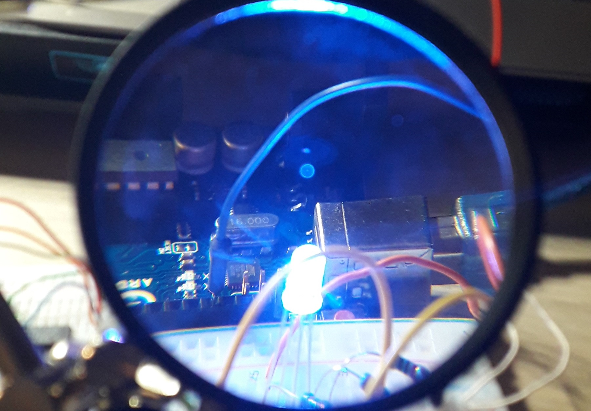

## My Arduino Projects

    

Resources:
- https://www.arduino.cc/reference/en/
- https://fritzing.org/ -> Circuit designer (the most used apparently), open-source
- https://randomnerdtutorials.com/ -> a lot of cool Arduino & Raspberry Pi projects here

## 1_8x8_led_matrix_simple_letter_prints
Prints letters to the matrix of LEDs. Made in 2019

https://github.com/p4ulor/Arduino-Projects/assets/32241574/ec9312cf-9087-4397-a8e1-a875b7e70d50

## 2_RGB-LED-when-dark
Turns on an RGB led when it's dark, using a photo resistor. Gives emphasis on blue (which is hard to set). Made in 2023

https://github.com/p4ulor/Arduino-Projects/assets/32241574/7a4c1585-dfb1-4930-9065-b2fdcad7599b

